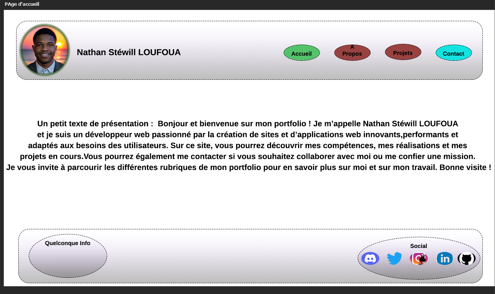

# Portfolio

**Création d’un Portfolio de Développeur Front ou Back** 🚀
>Dans le cadre de notre formation il nous a été donné un projet de réalisation d'un portfolio essentiel pour notre examen et même primordial pour notre quotidien en tant que Futur Dév dans le monde Professionnel.

>[Prévisualiser](https://lnstewill.github.io/Portfolio/)

**Objectif** 
>Le but de ce projet est de créer un portfolio en ligne attrayant qui mettra en valeur nos compétences en tant que développeur. Il servira de vitrine à nos projets, compétences et expériences.

**Description / Recommandations / Consignes**
>**[CLIQUER ICI](https://hackmd.io/nObokvRLSXeRq91_bIr4Dg)**

**DRAFT**
>Premièrement réalisation d'une maquette ou *Wireframe* afin d'avoir une meilleure vision de l'objectif que je dois atteindre

>Ensuite essayer de reproduire une page statique avec les différents éléments du Wireframe

**Ensuite les erreurs dans le code html**
 [>Tout checker sur le site](https://validator.w3.org/#validate_by_input)

> Essayer de réduire au maximum les erreurs et pourquoi pas atteindre un taux de *Zéro* 

**Pour la CSS**

***Conversion px to rem***

>Mise en place de la valeur de base **1rem = 16 px** et utiliser les rem plutôt que les pixels

>Gérer le responsive Design afin de faciliter la lisibilité sur la plupart des écrans.

**AVANCEMENT** 
> Le projet est en cours de développement pour l'instant la majorité des objectifs fixés ne sont pas encore atteint

> Je l'avancerait au plus vite pour atteidre ces objectifs
